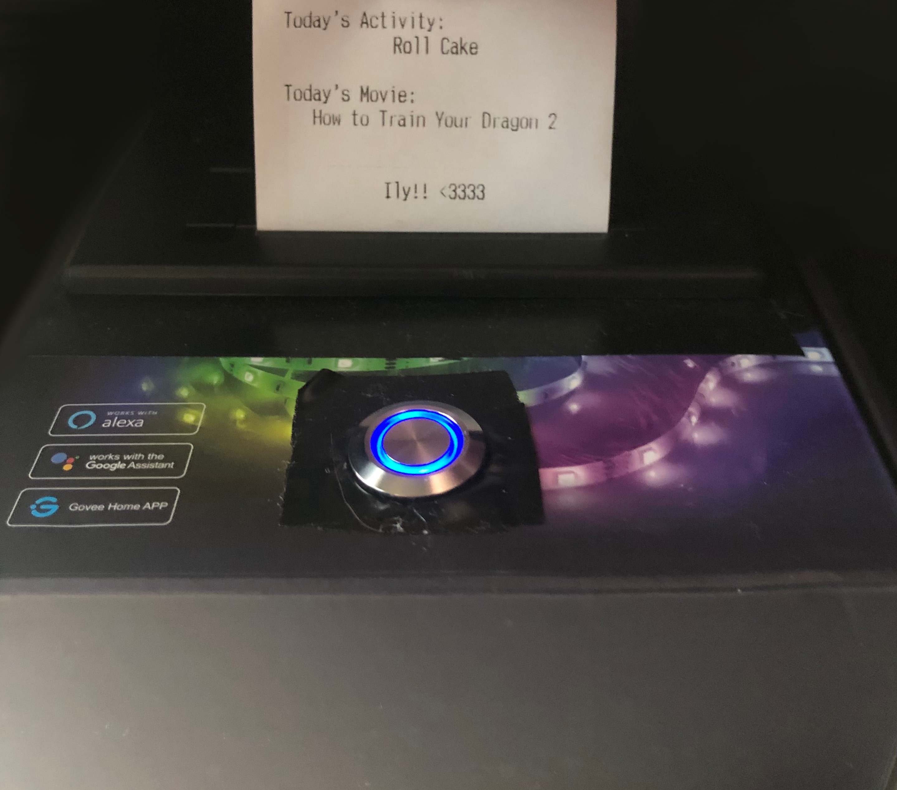
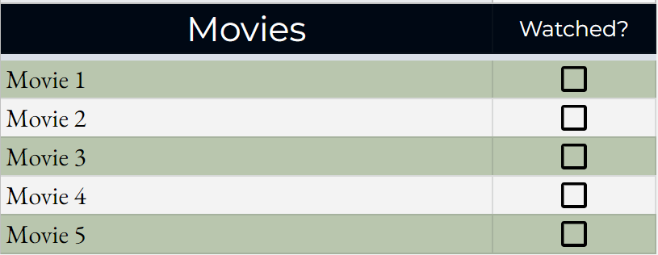

# OurBox

OurBox is a hardware project/gift built with NodeMCU and Google Sheets.

OurBox randomly chooses a movie/activity from a shared Google Sheet and prints it onto a receipt.

# Project Images

## The box

## The sheet

# Features

## The Box

On button press:

- Movie: Chooses a movie from the list
- Activity: Chooses an activity from the list

On button hold:

- Prints out a picture of us

## The Sheet

On item checked:

- Movie: The checked movie object is moved from the `Movies to Watch` sheet to the `Watched Movies` sheet via [`AppsScripts/moveRows.gs`](AppsScripts/moveRows.gs)

- Activity: The checked movie object is moved from the `Activities to Do` sheet to the `Activities DOne` sheet via [`AppsScripts/moveRows.gs`](AppsScripts/moveRows.gs)

# How it works

## The Box

Inside the box is a NodeMCU esp8266 board with a WiFi connection. By itself it doesn't do much, however, when the button is pressed:

1. The board asks the google app's (NodeSheetAPI) api for a movie and an activity.
2. The board generates a cute receipt to inform us of today's chosen movie and activity.

That's it.

The board also uses [WifiManager](https://github.com/tzapu/WiFiManager) to connect to new wifi networks and [HTTPSRedirect](https://github.com/electronicsguy/HTTPSRedirect) to query the api.

## The Sheet

The sheet is governed by two Google Apps Scripts.

[`moveRows.gs`](AppsScripts/moveRows.gs) - Attached to the sheet, this script checks the data values of the checkboxes on edit. If an item is newly checked, it will be moved to its respective done sheet. Ex: `Movies to Watch` -> `Movies Watched`

[`NodeSheetAPI.gs`](AppsScripts/NodeSheetAPI.gs) - Running independently, this script responds to queries made by the NodeMCU. On request, this script fetches either a random movie or random activity from the sheet and returns it to the NodeMCU for printing.

# Parts

## The Box

- [Mini Thermal Receipt Printer](https://www.adafruit.com/product/597)
- [Blue LED Pushbutton (16mm)](https://www.amazon.com/dp/B01G00GHQY)
- [NodeMCU Esp8266 Dev Board](https://www.amazon.com/dp/B07HF44GBT/)

## The Sheet

[Find the spreadsheet here.](https://docs.google.com/spreadsheets/d/1BCIeMgrSKmTzj2HvcG4cfiwgFYYceMNEe1QAbMFjtNQ/edit?usp=sharing)

# Interested in a box of your own?

[See the wiki for details.](https://github.com/latelylk/OurBox/wiki/Install)
